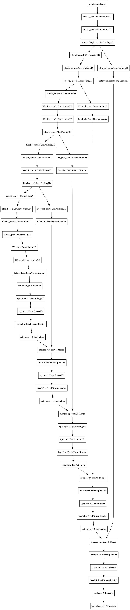

# Semantic segmentation for lane detection
### Implementing [this paper: Efficient Deep Models for Monocular Road Segmentation](https://lmb.informatik.uni-freiburg.de/Publications/2016/OB16b/)

[image1]: ./model.png "Model Visualization"
[image2]: ./examples/rmse_ukf.png "Model Visualization"

## Model architecture

<!--  -->

<!--  -->